# Diana Character Rig 

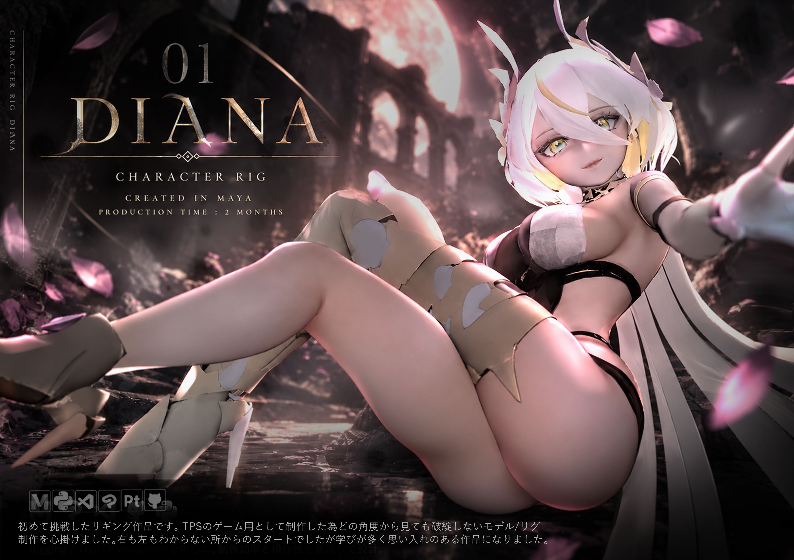


Autodesk Maya 2026で制作した、オリジナルキャラクター **Diana** のキャラクターリグです。

キャラクター2D原案と、素体をベースとしたモデル制作・リギングを担当しました。

IK / FK、指のSDK制御、リバースフット、武器制御などを実装しています。

特に、操作量が多くなりやすい**手指と武器周辺の操作性**を重点的に設計しました。

手指では一括操作と個別調整を使い分けられる構成を採用し、武器では、Sword / Shield / Bow / Arrowそれぞれに専用のリグを構築し、持ち替えや追従先の切り替えにも対応しています。

また、実際にアニメーション制作で使用しながら操作性を検証し、そこで発生した反復作業や問題をMaya Toolとして切り出すことで**リグだけでなく制作工程そのものの改善**にも取り組みました。

---

## リグ全体

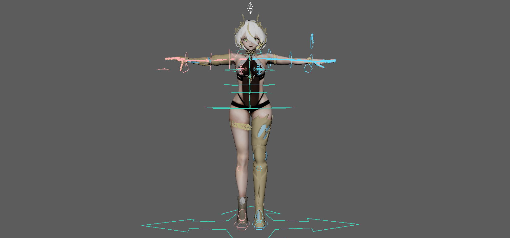

MODEL/RIG ターンテーブル
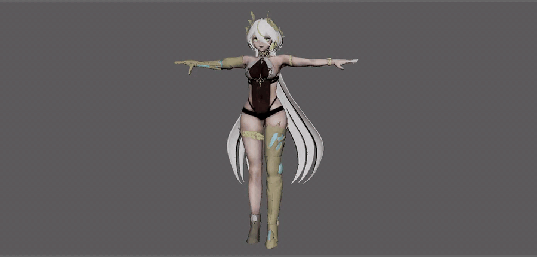

全身のポージングに必要な基本コントローラーに加え、手指・武器などをより柔軟に操作できる仕組みを作成しました。

主な機能は以下の通りです。

* ターミナル
* 指のSDK一括制御
* 指の個別FK制御
* 腕のIK / FK切り替え
* IK / FKポーズマッチ(専用ツール)
* 背骨のスプラインIK
* 揺れ物(バスト・ヒップ)
* リバースフット
* 武器リグ
* 武器専用ツール


内部構造を直接操作しなくても、アニメーションを制作できる構成を目指しました。

---

---

# ターミナル

全体の管理をするコントローラーです。
現在は武器・髪の毛のFKコントローラーの表示/非表示を設定できます。

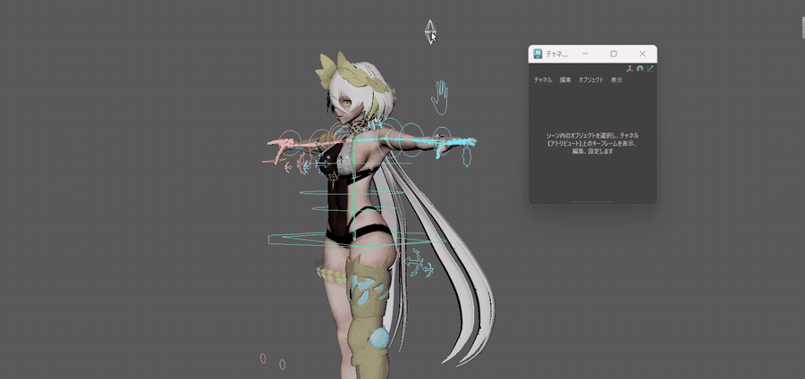

今後追加する機能などもこちらに追加していく予定です。


---

# 手指のリグ

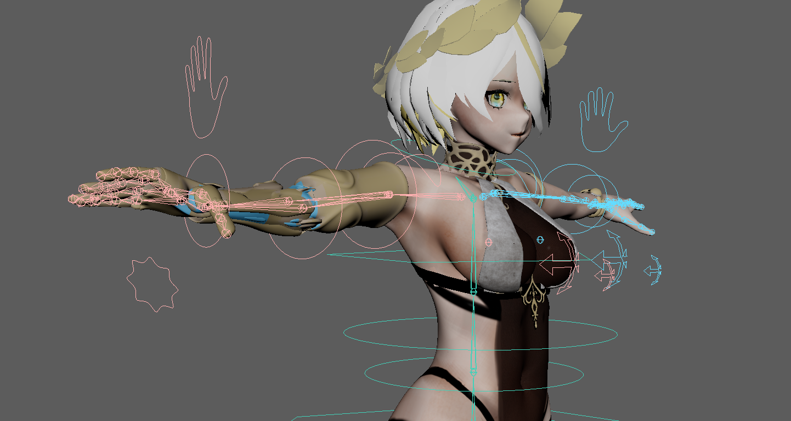


チーム内のアニメーターにヒアリングをしながら進め、Diana Rigでは、特に**手指周辺の操作性**を重点的に設計しています。

ゲームアニメーションでは、手を握る・開くといった大きな動きだけでなく、武器の形状に合わせて指先を細かく調整する必要があります。

そこで、FK/IK切り替えやFKコントローラーとは別に

**「チャネルエディタによる一括操作」と「コントローラーによる一括操作」**

のSDK(セットドリブンキー)両方を用意しました。(詳細は以下に続きます)

どちらもFKコントローラーとの加算併用が可能です。

---

## setting_anim

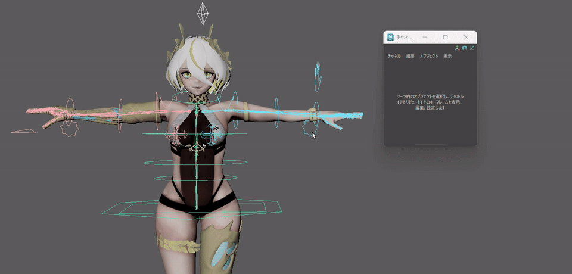

手指には複数の操作方法があるため、各手の後ろに配置しているsetting_animというコントローラーから操作状態を切り替えられるようにしています。

内部では`choice`などのUtility Nodeを使用し、操作モードに応じてJointへ渡す値を切り替えています。


```text
SDKからの入力 ────┐
                  ├─ choice ─→ Finger Joint
個別操作からの入力 ─┘
                       ↑
                  操作モード
```

---

# SDKによる一括操作

## fingers_anim


指にはSDKを使用し、複数の関節をまとめて操作できるようにしています。

親指には個別にON/OFF設定があり、OFFの場合はSDKの値が親指にのみ反映されません。これはどちらのSDKにも同様に入れ込んであります。

`Curl`、`Spread`、`Relax`、`Fist`、親指の操作など、使用頻度の高い動きをアトリビュートへまとめることで、各関節を一本ずつ操作する手間を減らしています。


```text
手指のAttribute
      ↓
Set Driven Key
      ↓
各指の回転
      ↓
Finger Joint
```

まずSDKから大まかな手の形を作り、必要な部分だけ個別に調整することを想定しています。

---

## hand_anim


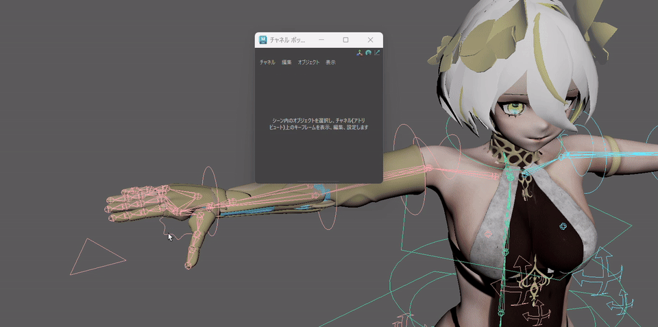

finger_animよりも直感的に操作できるコントローラーを追加しました。アニメーターの好みによって使い分けや併用が可能なように選択肢を増やしました。

同一コントローラー内での加算にも対応しています。

上記と同じく、

**一括操作で大きな形を作る → 必要な指だけ細かく調整する**

という流れでポーズを作れるようにしました。

また、こちらも親指には個別にON/OFF設定があり、OFFの場合はSDKの値が親指にのみ反映されません。

---

## FKコントローラー

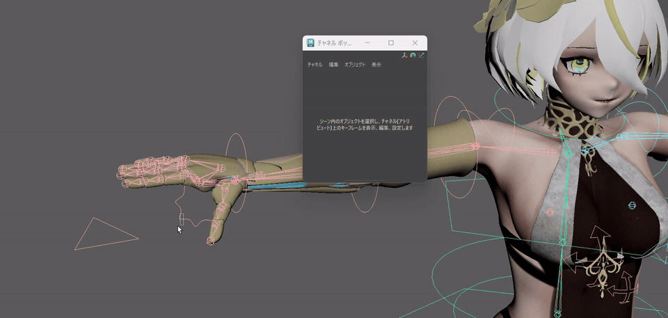

一般的な指用のコントローラーです。

各SDKの微調整用として併用も可能です。
重ならず掴みやすいという利点があったためPin型を採用しました。

---

# 腕のIK / FK

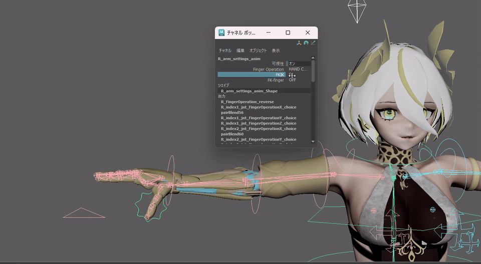

腕は左右ともIK / FKの切り替えに対応しています。

FKでは肩・肘・手首を回転させてポーズを作成し、IKではHand ControllerとPole Vector Controllerから腕を操作します。

ポーズ合わせには専用マッチャ―を製作しました。


## IK / FKポーズマッチ

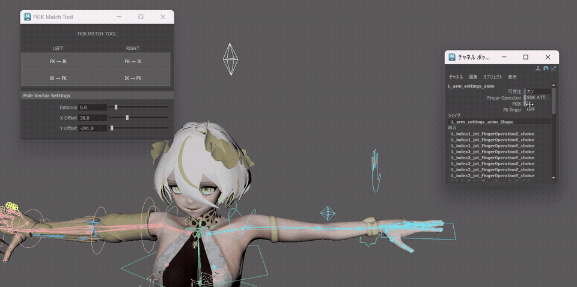

IK / FK切り替え時に発生するポーズのズレを減らすため、Controllerの位置・回転を自動的に合わせる**FK / IK Auto Matcher**を制作しました。

```text
現在のポーズ
      ↓
Jointの位置・回転を取得
      ↓
切り替え先Controllerへ反映
      ↓
IK / FK切り替え
```

Diana Rigで使用するためのポーズ合わせから始まり、その後、より汎用的に使用できる独立した**Auto-Macher**へ発展させました。

---

# Spine(スプラインIK)


背骨にはスプラインIKを使用し、腰から胸部までのシルエットをしなやかに調整できる構成にしています。


---

# 揺れ物


コントローラーの可動範囲に制限を設けることで、極端な操作を行っても形状が破綻しにくい構成にしています。

柔らかい表現ができるようにウェイト調整には時間をかけて何度も動かしながら確認しました。

手付けでも自然な揺れを表現できるよう、バスト・ヒップにはそれぞれ2本のJointを配置しています。

---

# リバースフット

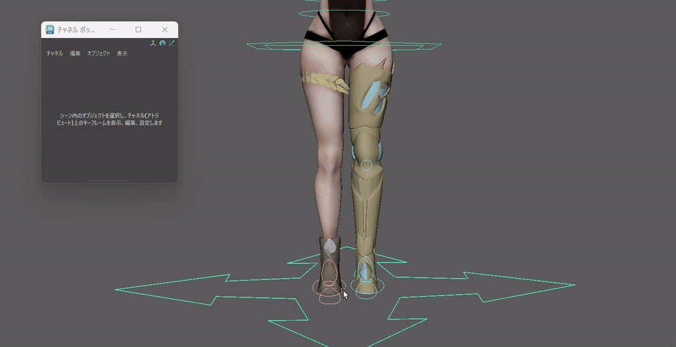

足には**リバースフット**を実装しています。

踵・つま先などを基準とした回転を操作でき、歩行・走行・踏み込みなどのアニメーションを作りやすい構成にしています。

TPSアクションゲームのためモーションの自由度を上げたいと思い取り入れました。

---

# 武器リグ


Dianaが使用する

**Sword / Shield / Bow & Arrow**

には、それぞれ専用のリグを構築しています。

単純に武器を手へ固定するのではなく、アニメーション中の**持ち替え・追従先の変更・位置調整**まで想定した構成です。

---

## 武器の追従構造


左右の手には武器を追従させるためのSocketを配置しています。

武器をHand Jointへ直接接続するのではなく、武器側にFollow Groupを設け、そのGroupを左右のSocketへ追従させています。

```text
右手Socket ───┐
              ├─ Parent Constraint
左手Socket ───┘
                     ↓
               Follow Group
                     ↓
                  武器Rig
```

これにより、武器自体のリグ構造を変更せずに追従先を切り替えられます。

---

## 剣のリグ


剣には専用のコントローラーとFollow Groupを用意しています。

キャラクターの手へ直接固定するのではなく、左右の手に配置したSocketを介して追従させています。

---

## 剣の持ち替え

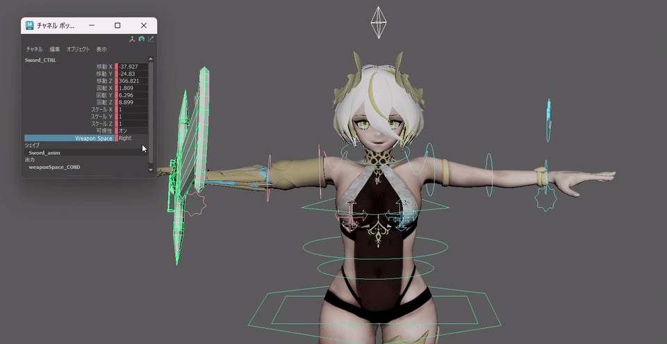

Swordでは`weaponSpace` Attributeから現在の持ち手を変更します。

内部では`condition` Nodeを使用し、アトリビュートの値に応じてParent Constraintのウェイトを切り替えています。


```text
weaponSpace
     ↓
 condition
   ↙      ↘
右手Weight  左手Weight
   ↘      ↙
Parent Constraint
      ↓
Sword Follow Group
```

**「Attributeを変更するだけで左右の追従先が切り替わる」**

という操作の裏側を、ノードとコンストレインによって構成しています。

---

## 盾のリグ

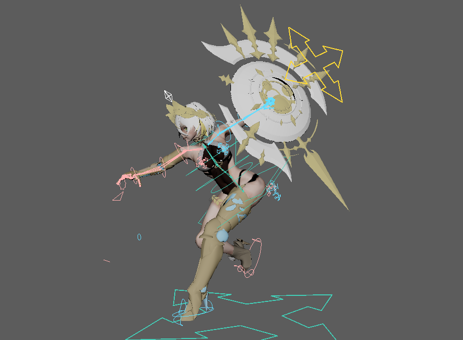

Shieldにも専用のControllerとFollow Groupを用意しています。

Swordと同様に左右の手への追従を切り替えられる構成とし、装備状態やアニメーションに応じて持ち手を変更できます。


剣と盾で共通した考え方を使用することで、武器ごとに大きく異なる操作方法にならないようにしています。

---

## 弓・矢のリグ

BowはSwordやShieldと比較して操作対象が多いため、**弓本体・矢を分けて制御**しています。

弓本体には持ち手を切り替える仕組みを持たせ、StringとArrowにはそれぞれ専用のControllerや追従構造を用意しています。


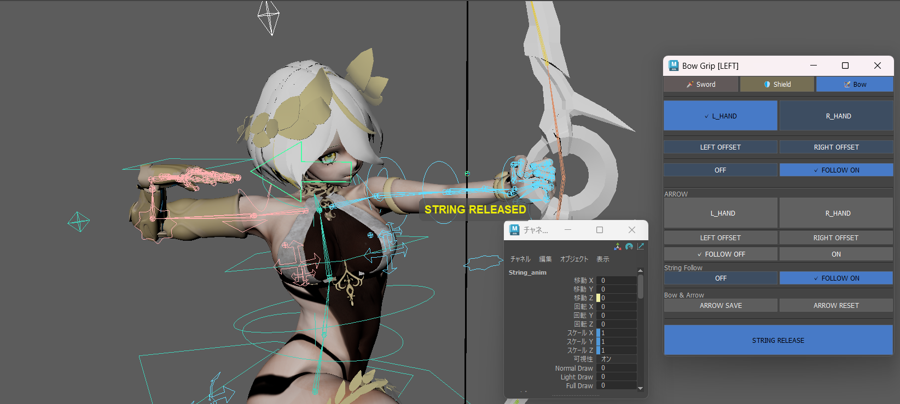


弓本体もFollow Groupを介して左右の手へ追従させることで、リグ自体のHierarchyを変更せずに持ち手を切り替えられるようにしています。


# Equipment Manager


武器リグを実際にアニメーションで使用すると、持ち替えや追従先の変更に伴って複数の操作が発生します。

そこで、武器操作で繰り返し発生する処理を専用の**Equipment Manager**としてツール化しました。

Sword / Shield / Bowなどの持ち替えやFollow操作をまとめ、アニメーション時の装備制御を効率化しています。

リグそのものを置き換えるのではなく、Diana Rigに構築したAttributeやConstraintを利用しながら、アニメーターが行う操作手順をまとめるためのツールとして制作しています。


詳細は以下をご覧ください。

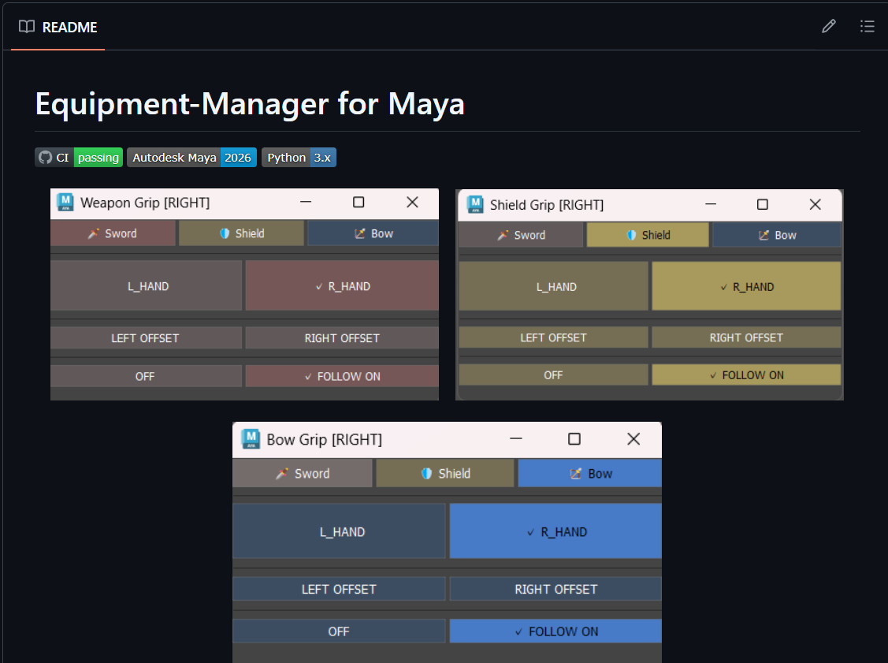


【 https://github.com/Yuzuki-Midoshima/Equipment-Manager 】

【 https://www.vivivit.com/works/1158926 】

---

# ツール制作

Diana Rigの制作で発生したController作成・調整作業を、他のリグでも再利用できる形へ発展させています。

---

# リグからツール開発へ


Diana Rigは、リグを完成させて終わりではなく、実際にアニメーションで使用しながら改善を続けました。

```text
キャラクターリグ制作
        ↓
アニメーションで検証
        ↓
問題・反復作業を発見
        ↓
リグ構造を改善
        ↓
必要な処理をツール化
        ↓
再度アニメーションで検証
```

この制作から、

* Equipment Manager
* Controller Shape Library
* Rig-Ctrl-Shape-Tool
* Finger SDK Tool
* FK / IK Auto Matcher
* FK-Builder

などのMayaツールへ発展させています。

一体のキャラクターを動かすためのリグだけでなく、**制作中に見つけた課題を、次の制作でも再利用できる仕組みに変えること**を意識して制作しました。

---

# 関連ツール

## Equipment Manager


武器の装備制御を補助するDiana専用のアニメーション補助ツールです。

[GitHub](https://github.com/Yuzuki-Midoshima/Equipment-Manager)

## Rig-Ctrl-Shape-Tool

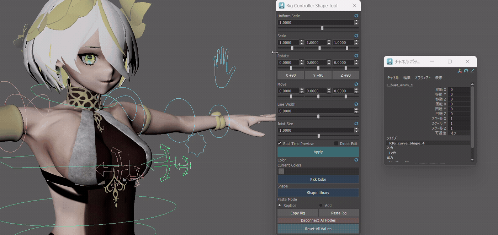

コントローラーの接続を変えず見た目だけを変更するツールです。形・色の変更やコントローラーのコピー＆ペーストができます。


[GitHub](https://github.com/Yuzuki-Midoshima/Rig-Ctrl-Shape-Tool)

## Finger SDK Tool

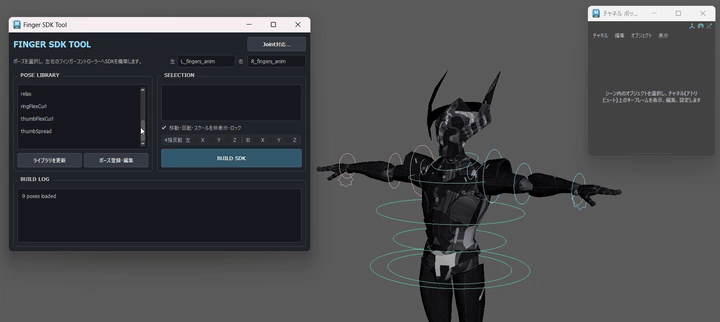

Finger SDKの保存・再構築・修正を補助するツールです。JSONで管理しているためSDKの新規登録や編集にも対応しています。

[GitHub](https://github.com/Yuzuki-Midoshima/Finger-SDK-Tool)

## FK-Builder

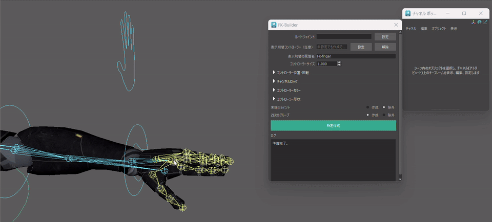

FKコントローラーを自動生成するツールです。色や形状はもちろん、初期値やロックの調整も可能です。ON/OFFの管理コントローラーの設定もできます。


[GitHub](https://github.com/Yuzuki-Midoshima/FK-Builder)

## FK / IK Auto Matcher


IK / FK切り替え時のポーズマッチを自動化するツールです。オーソドックスな仕組みの物であればどのリグでも使用可能です。

[GitHub](https://github.com/Yuzuki-Midoshima/FK-IK-AutoMatcher)


## Controller Shape Library

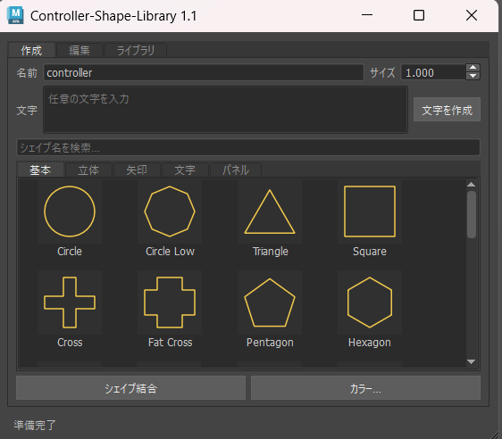

Controller Shapeの作成・管理・編集を効率化するツールです。他のツールに組み込むことを前提にした設計になっています。

[GitHub](https://github.com/Yuzuki-Midoshima/Controller-Shape-Library)

---

# 制作環境

```text
Autodesk Maya 2026
Python
Windows
```

---

# Portfolio

デザイン・技術解説はポートフォリオとしてViViViTにも掲載しています。
宜しければ併せてご覧ください！

[ViViViT](https://vivivit.com/yuzuki_midoshima)

---

# GitHub

制作したツールやテクニカルアート関連プロジェクトを公開しています。

[GitHub - Yuzuki Midoshima](https://github.com/Yuzuki-Midoshima)

---

# License

MIT License

Copyright (c) 2026 Yuzuki Midoshima
